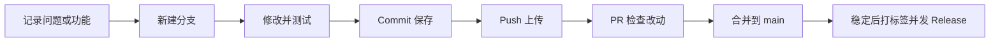

# 用 Token Monitor 学会 GitHub 项目管理

你已经有了一个项目：Token Monitor。GitHub 帮你保存源码、记录每次改动，并保留可以下载的稳定版本。

## 先分清 Git 和 GitHub

**Git** 是本机记录文件变化的工具。**GitHub** 是保存 Git 仓库的在线平台，并提供问题清单、改动审核和发布页。

平时编辑文件后，先 Commit 保存到本机历史，再 Push 上传到 GitHub。**只 Commit，没有 Push，新的改动还没有完成云端备份。**

## 这次建立的项目结构

| 名称 | 作用 | 在这个项目里的例子 |
| --- | --- | --- |
| Repository / 仓库 | 存放项目文件和修改历史 | `Ricki0613/TokenMonitor` |
| README | 项目首页说明 | 功能、下载、使用、构建方法 |
| Commit / 提交 | 一次有说明的修改记录 | “修复窗口位置保存” |
| Branch / 分支 | 单独开发一项改动 | `feature/dark-mode` |
| main | 默认主分支 | 已确认可以保留的版本 |
| Issue | 记录待办、问题或想法 | “增加深色模式” |
| Pull Request / PR | 比较并检查分支改动的入口 | 查看深色模式改了哪些文件 |
| Merge / 合并 | 把分支改动并入目标分支 | 合并到 `main` |
| Tag / 标签 | 给一个确定的版本起固定名字 | `v1.0.0` |
| Release / 发布 | 版本说明与可下载的程序包 | 第一版 Windows ZIP |

本项目目前为私有仓库，只有获得访问权限的人可以查看。发布在私有仓库里的 Release 也需要相应访问权限。

## 推荐你采用的日常流程

例如想增加深色模式：

1. 在 Issues 新建“增加深色模式”，说明希望窗口背景、字体和开关怎样变化。
2. 从最新 `main` 新建 `feature/dark-mode` 分支。
3. 完成功能后运行构建与自测，再亲自打开程序看界面。
4. Commit 时写清楚这一批做了什么，例如“feat: 增加深色模式设置”。然后 Push 到 GitHub。
5. 发起 PR，目标分支选 `main`。检查文件变化、测试结果，以及有没有误加本机配置。
6. 确认后 Merge。该功能完成的 Issue 可以关闭；合并后的功能分支也可以删除。
7. 如果要留下一个可下载的稳定版，再更新 CHANGELOG、创建标签并发布新 Release。

一个人维护项目也可以自己检查 PR。小的说明文字修改可以直接 Commit / Push 到 `main`；涉及功能或行为的改动采用分支更方便比较和回退。

## 用 GitHub Desktop 操作

本机已经装有 GitHub Desktop，可以先用图形界面，不必记很多命令。

### 把项目保存到一个长期使用的本地目录

打开 GitHub Desktop，选择 **File → Clone repository**，找到 `Ricki0613/TokenMonitor`，选择一个开发目录（例如 `D:\Projects\TokenMonitor`），然后 Clone。

这会下载源码和版本历史。建议把开发目录与 `D:\Apps\TokenMonitor` 运行目录分开：前者用于改代码，后者保存运行程序和本机密钥。不要把整个运行目录拖进仓库。

如果已经有本次创建的本地 Git 仓库，也可以选择 **File → Add local repository** 添加它，无需重复 Clone。

### 每次修改时

1. 开始前点 **Fetch origin**；有远端更新时再 Pull。
2. 在 **Current branch** 新建本次修改的分支。
3. 修改代码后，回到 **Changes** 查看哪些文件发生了变化。
4. 在 **Summary** 写一句清楚的说明，点击 **Commit to 分支名**。
5. 点击 **Publish branch** 或 **Push origin**，上传改动。
6. 在 GitHub 网页创建 PR、检查差异并合并。

`Fetch` 是检查远端有什么更新；`Pull` 会把远端更新带入本地分支；`Push` 是把本机已有提交上传。遇到合并冲突时先停下来处理文件中的不同修改，不要直接覆盖或强制推送。

## 如何找回第一版

**只想运行旧版：**去 [v1.0.0 发布页](https://github.com/Ricki0613/TokenMonitor/releases/tag/v1.0.0)，下载程序 ZIP。

**想查看旧版源码：**在仓库分支选择器中选 Tags → `v1.0.0`。标签对应的源码可以与后续版本比较。

**后续改坏了：**先保留当前工作，再根据需要用 Revert 撤销某个提交，或从旧标签新建修复分支。不要为了恢复旧版随意删除历史或强制覆盖远端。

## 版本号怎么起

可以采用下面的个人项目约定：

- `v1.0.1`：修复问题，例如修复某个窗口被遮挡。
- `v1.1.0`：增加兼容的新功能，例如深色模式。
- `v2.0.0`：较大且不兼容的变化，例如配置格式需要迁移。

普通 Commit 不需要每次都发布 Release。完成一个你愿意长期保留、方便重新下载的版本时再发布。已经发布的 `v1.0.0` 留作固定记录，后续修改用新版本号。

## 什么时候需要 Projects 看板

目前先用 Issues 管理待办即可。功能和问题多了，再建一个 Projects 看板，用“待做 / 进行中 / 已完成”跟踪进度。不需要一开始就配置复杂流程。

## 一条容易坚持的习惯

每做完一个独立改动，就检查文件、写清 Commit 说明并 Push。发布稳定版时补上 CHANGELOG 和 Release。密钥只放在本机设置中，提交前看一遍 Changes。

以后也可以直接告诉助手：

> 给 Token Monitor 增加深色模式，在新分支完成，测试后创建 PR。

> 把已经确认的改动发布为 v1.1.0，保留 v1.0.0。

## 官方入门资料

- [GitHub Flow：从分支到合并](https://docs.github.com/en/get-started/using-github/github-flow)
- [GitHub Desktop：提交和上传改动](https://docs.github.com/en/desktop/overview/creating-your-first-repository-using-github-desktop)
- [用 GitHub Desktop 克隆仓库](https://docs.github.com/en/desktop/adding-and-cloning-repositories/cloning-and-forking-repositories-from-github-desktop)
- [Release 与标签是什么](https://docs.github.com/en/repositories/releasing-projects-on-github/about-releases)
